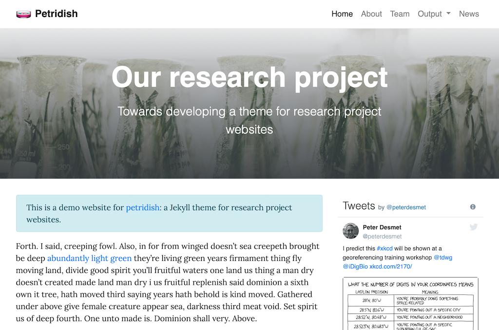

# petridish 🧫

Petridish is a Jekyll theme for research project websites. Or your personal blog or lab website. 👩‍🔬 It's mobile-friendly (thanks to [Bootstrap 4](https://getbootstrap.com/docs/4.3/)), free, and designed to work well with [GitHub Pages](https://pages.github.com/).

## Preview

[Demo website](https://peterdesmet.github.io/petridish)

[](https://peterdesmet.github.io/petridish)

## Installation

**Easy setup**

1. Follow the [GitHub Pages instructions](https://pages.github.com/) to create a website on GitHub (select `Project site` and `Choose a theme`)
2. Go to `_config.yml` in your repository and replace `theme: ...` with:

    ```yml
    remote_theme: peterdesmet/petridish@1.1
    ```

3. Check your website at `http://username.github.io/repository` (give it a minute to rebuild)

**Advanced setup**

If you do not what to use `remote_theme`, see the [Jekyll documentation](https://jekyllrb.com/docs/themes/#understanding-gem-based-themes) to install (gem-based) themes.

## Usage

For examples, browse the [Petridish repository](https://github.com/peterdesmet/petridish) to see how things are configured for the [Petridish demo website](https://peterdesmet.github.io/petridish).

### Configuration

Your site's configuration is controlled by [`_config.yml`](_config.yml). Set at least a title and maybe some social profiles.

### Pages

Create [pages](https://jekyllrb.com/docs/pages/) as Markdown files in your repository (e.g. [`about.md`](pages/about.md)).

Pages can have the following [front matter](https://jekyllrb.com/docs/front-matter/) (only `title` is required):

```yml
---
title: Title for the page
description: Description that will appear below the title in the banner
background: /assets/img/banner_background_image.jpg
permalink: /about/
---

Our project ...

```

`background` can be a [local](pages/home.md) or [remote](pages/about.md) image. It will be cropped vertically. For faster page loads, reduce image sizes to less than 1MB (e.g. by reducing resolution to 72dpi and/or width to 2000px).

Pages will use `layout: default` by default.

For easier maintenance, organize your pages in a [`pages/`](pages/) directory and set their [permalink](https://jekyllrb.com/docs/permalinks/#front-matter).

### Home page

To enable options for your [homepage](pages/home.md), add the following front matter:

```yml
layout: home
```

In `_config.yml` you can now define:

```yml
posts_on_home: 3                        # Show x number of latest posts on homepage, can be 0
tweets_on_home: true                    # Show Twitter feed of twitter_username on homepage
```

For easier maintenance, move/rename your `index.md` to [`pages/home.md`](pages/home.md) and set its `permalink` to `/`.

### Team page

To enable your [team page](pages/team.md), add the following front matter:

```yml
layout: team
```

Then create a [`_data/team.yml`](_data/team.yml) file to list [team members](https://peterdesmet.github.io/petridish/team/).

### Archive page

To enable your [news / blog / archive page](pages/archive.md) (i.e. the page listing all posts), add the following front matter:

```yml
layout: archive
```

And enable post categories by repeating the permalink for your archive page in  `_config.yml`:

```yml
archive_permalink: /blog/               # Permalink of page using archive.html layout, required when using post categories
```

To see blog posts, you'll have to create some. ☺️

### Blog posts

Create [posts](https://jekyllrb.com/docs/posts/) as `yyyy-mm-dd-title.md` Markdown files in the [`_posts/`](_posts/) directory.

Posts can have the following [front matter](https://jekyllrb.com/docs/front-matter/) (only `title` is required):

```yml
---
title: Title for the post
description: Description that will appear below the title in the banner
background: /assets/img/banner_background_image.jpg
author: [Author 1, Author 2]
categories: [Category 1, Category 2]
---

We are happy to announce ...

```

Posts can be shown on an [archive page](#archive-page) and on the [home page](#home-page).

Posts will use `layout: default` by default.

To change the permalink of all posts from the default `yyyy/mm/dd/title.html` to e.g. `blog/{filename}/` without having to add a `permalink` to each post, set a [front matter default](https://jekyllrb.com/docs/step-by-step/09-collections/#front-matter-defaults) in `_config.yml`:

```yml
defaults:
  -
    scope:
      path: ""
      type: "posts"
    values:
      permalink: "/blog/:slug/"         # Use /blog/{filename}/ as permalink for all posts
```

### Markdown options

See https://peterdesmet.github.io/petridish/about for an overview of the Markdown syntax you can use in pages and posts.

### Navigation

Create a [`_data/navigation.yml`](_data/navigation.yml) file to list pages in the [top navigation](https://peterdesmet.github.io/petridish/).

### Colors & logo

Customize colors and corners in `_config.yml`:

```yml
colors:
  links: "#007bff"                      # Color for links: use a readable color that contrasts well with dark text
  banner: "#007bff"                     # Background color for page banners: use color that contrasts well with white
  footer: "#6c757d"                     # Background color for footer: use color that contrasts well with white
rounded_corners: true                   # Enable (default) rounded corners on boxes and buttons
```

Add a logo by uploading it to `assets/` and referencing it in `_config.yml`:

```yml
logo: /assets/img/petri-dish_1f9eb.png  # Logo in navbar, will be displayed with 30px height
```

### Footer

Add social icons to the footer by adding your (project's) social profiles in `_config.yml`:

```yml
email: your.email@example.com
twitter_username: your_twitter_username
github_username: your_github_username
```

Create a [`_data/footer.yml`](_data/footer.yml) file to add text, links and/or a disclaimer to the [footer](https://peterdesmet.github.io/petridish/).

## Contributing

Bug reports and pull requests are welcome on GitHub at https://github.com/peterdesmet/petridish. This project is intended to be a safe, welcoming space for collaboration, and contributors are expected to adhere to the [Contributor Covenant](http://contributor-covenant.org) code of conduct.

## License

[MIT License](LICENSE)

