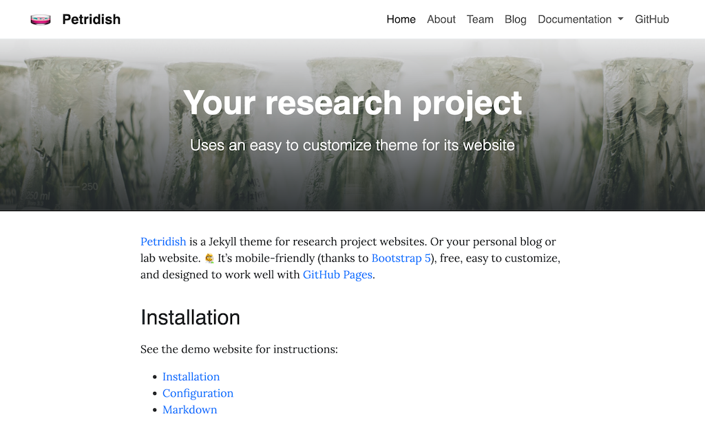

# petridish 🧫

Petridish is a Jekyll theme for research project websites. Or your personal blog or lab website. 👩‍🔬 It's mobile-friendly (thanks to [Bootstrap 5](https://getbootstrap.com/docs/5.1/)), free, easy to customize, and designed to work well with [GitHub Pages](https://pages.github.com/).

## Installation

See the demo website for instructions:

- [Installation](https://peterdesmet.github.io/petridish/docs/installation)
- [Configuration](https://peterdesmet.github.io/petridish/docs/configuration)
- [Markdown](https://peterdesmet.github.io/petridish/docs/markdown)

## Preview

[Demo website](https://peterdesmet.github.io/petridish)

## Contributing

Bug reports and pull requests are welcome on GitHub at https://github.com/peterdesmet/petridish. This project is intended to be a safe, welcoming space for collaboration, and contributors are expected to adhere to the [Contributor Covenant](http://contributor-covenant.org) code of conduct.

## License

[MIT License](LICENSE)

---

<!-- All the above is about the Petridish theme, so you might want to remove that. -->

_The instructions below can be adapted/included in the README of your site repository._

## Usage

This website makes use of the static website generator [Jekyll](https://jekyllrb.com/) and the [Petridish](https://github.com/peterdesmet/petridish) theme. **Each commit to `main` will automatically trigger a new build on GitHub Pages.** There is no need to build the site locally, but you can by installing Jekyll and running `bundle exec jekyll serve`.

Minor changes can be committed directly to `main`.

Changes requiring review (e.g. new blog posts) should be created in a separate branch and submitted as a pull request. Some guidelines:

- Use `72dpi` as image resolution
- Place background images in `assets/backgrounds/`, name them after their corresponding page/post and ideally crop them to `2100 x 700px`
- Place content images in `assets/images/`, name them after their corresponding page/post + a suffix, e.g. `-figure-1`
- Add tags to posts to create relevant groups (e.g. same topic, project).
- Create internal links as `[previous post]({{ '/permalink/to/post/' | relative_url }})`

## Repo structure

The repository structure follows that of Jekyll websites.

- General site settings: [_config.yml](_config.yml)
- Pages: [pages/](pages/)
- Posts: [_posts/](_posts/)
- Images & static files: [assets/](assets/)
- Top navigation: [_data/navigation.yml](_data/navigation.yml)
- Footer content: [_data/footer.yml](_data/footer.yml)
- Team members: [_data/team.yml](_data/team.yml)
